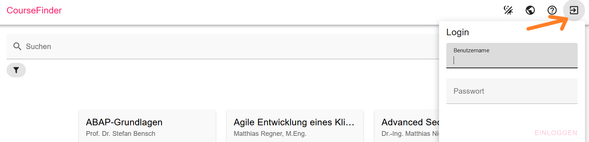
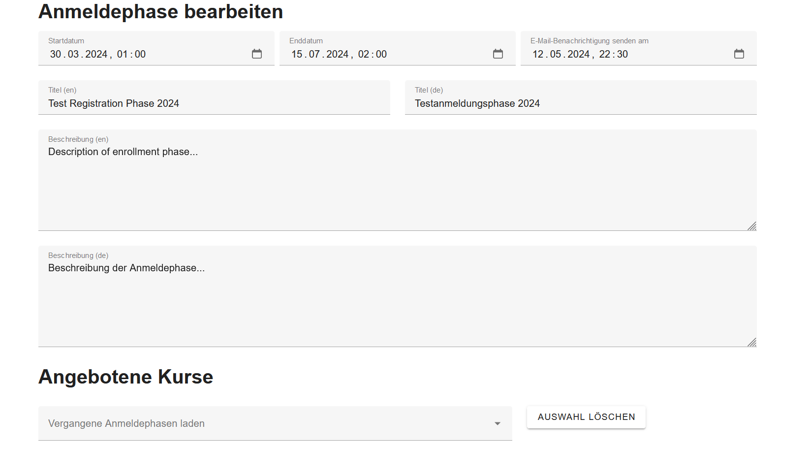
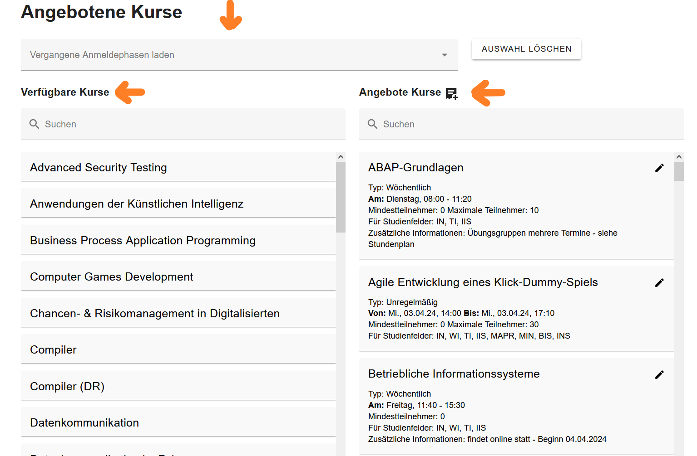
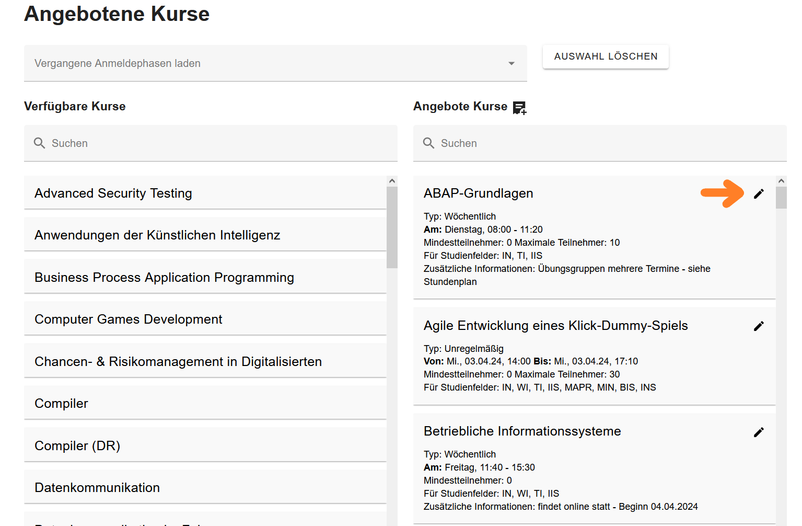
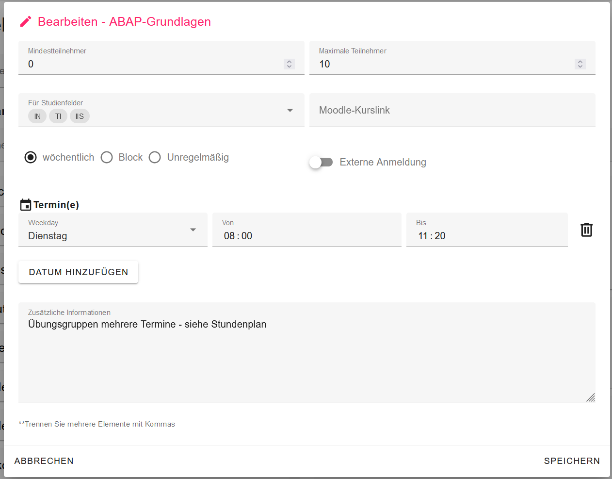
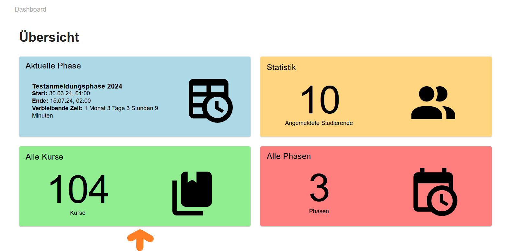
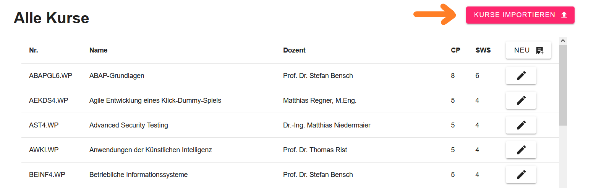
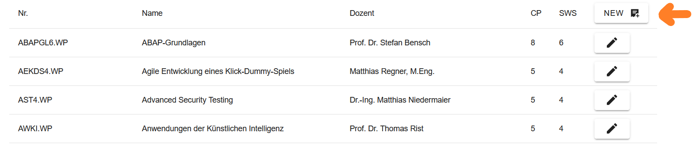

# Dokumentation der Webseite für den Admin

Diese Dokumentation bietet eine umfassende Übersicht über die verschiedenen Funktionen, die speziell auf die Bedürfnisse des Admins abgestimmt sind. 

## 1 Anmeldung als Admin

Um sich anzumelden, muss der Admin auf der Startseite den Login-Button anklicken. Dieser Button befindet sich in der Navigationsleiste. Nachdem der Admin den Button betätigt hat, wird er dazu aufgefordert, sich mit Benutzernamen und Passwort anzumelden. 

Sobald die Anmeldung erfolgreich gewesen ist, wird dem Admin in der Navigationsleiste der Admin-Button angezeigt, dieser Button wird als Krone dargestellt. Mithilfe dieses Buttons gelangt man zur Admin-Startseite.

## 2 Navigation durch die Webseite als Admin

### **2.1 Admin-Startseite**

Die Admin-Startseite ist eine Übersicht, die folgende Informationen und Funktionen bietet:

- **Aktuelle Phase:** Informationen über die aktuelle Phase (Sommersemester/Wintersemester, Start, Ende und verbleibende Zeit, verfügbare Kurse in der aktuellen Phase). Sobald man darauf klickt, kann man die aktuelle Phase bearbeiten.
- **Statistik:** Übersicht über die Anzahl der Studenten, die sich bereits für die Wahlpflichtfächer angemeldet haben.
- **Alle Kurse:** Hiermit kann der Admin alle Wahlpflichtfächer einsehen, bearbeiten und nach Bedarf neue Wahlpflichtfächer hinzufügen.
- **Alle Phasen:** Hiermit kann der Admin alle Phasen einsehen, bearbeiten und neue Phasen hinzufügen.

### **2.2 Aktuelle Phase bearbeiten**

Wenn man auf der Admin-Startseite auf den Kasten klickt, in dem sich die aktuelle Phase befindet, kann man diese aktuelle Phase bearbeiten. Zudem kann der Admin den Zustand der Phase ändern. Dabei gibt es drei Optionen, zwischen denen der Admin auswählen kann: Geschlossen, Offen, Ziehung.

Sobald der Admin auf den "Bearbeiten" - Button klickt, gelangt er zur Ansicht, in der er die aktuelle Phase bearbeiten kann. Dazu gehört:

- **Startdatum:** Wann die Phase beginnen soll.
- **Enddatum:** Wann die Phase beendet werden soll.
- **Datum für E-Mail Benachrichtigung:** Das Datum, an dem die E-Mail Benachrichtigung versendet werden soll.
- **Titel der Phase:** In Englisch und Deutsch (z.B. FWP Anmeldung Wintersemester).
- **Beschreibung der Phase:** In Englisch und Deutsch (z.B. Anmeldung zu den Wahlpflichtfächern für das Sommersemester 2024).

Nun kann der Admin auch die angebotenen Kurse für die aktuelle Phase bearbeiten. Dabei befinden sich auf der linken Seite alle Kurse, die existieren, und auf der rechten Seite befinden sich die Kurse, die man für die aktuelle Phase anbieten möchte.

- **Kurse hinzufügen:** Um Kurse der aktuellen Phase hinzuzufügen, muss man den jeweiligen Kurs von der linken Seite (Liste der verfügbaren Kurse) auf die rechte Seite (Liste der angebotenen Kurse) per Drag and Drop ziehen. Der Admin muss auf den Kurs klicken, die Maustaste gedrückt halten, diesen Kurs dann in die Liste der angebotenen Kurse ziehen und letzlich die Maustaste loslassen.

- **Kurse entfernen:** Wenn man einen Kurs nicht mehr in der aktuellen Phase anbieten möchte, muss man den Kurs aus der Liste der angebotenen Kurse anklicken und in die Liste der verfügbaren Kurse ziehen.

- **Vergangene Anmeldephasen:** Falls man die Kurse der vergangenen Anmeldephasen laden möchte, muss man lediglich auf das Dropdown-Menü klicken und anschließend eine Option auswählen.

#### Angebotene Kurse der aktuellen Phase bearbeiten

Der Admin ist ebenfalls in der Lage, die Kurse zu bearbeiten die in der aktuellen Phase angeboten werden, indem er auf den Stift klickt, der sich neben dem Namen des jeweiligen Kurses befindet. 

Sobald der Admin auf den Stift klickt, wird ein Pop-up-Fenster angezeigt. Dieses ermöglicht es, folgendes zu bearbeiten:

- **Anzahl der Mindestteilnehmer**
- **Anzahl der maximalen Teilnehmer**
- **Moodle-Kurslink:** Link für den Moodle-Kurs
- **Externe Anmeldung:** Falls "Externe Anmeldung" ausgewählt wird, bedeutet dies, dass es sich um einen Kurs handelt, für den man sich nicht über diese Webseite anmelden kann. Jedoch wird der Kurs den Studenten dennoch angezeigt, damit sie wissen, dass dieser Kurs in dem Semester stattfindet. Ein Beispiel für einen Kurs, der eine externe Anmeldung benötigt, wäre "Computer Games Development", da die Anmeldung für diesen Kurs über Moodle erfolgt.
- **Studienfelder:** Für welche Studienfelder dieser Kurs angeboten werden soll
- **Veranstaltungsart:** Auswahl zwischen drei Optionen: wöchentlich, unregelmäßig oder Blockveranstaltung
- **Termine:** Festlegung, zu welcher Uhrzeit und an welchem Datum der jeweilige Kurs stattfindet
- **Zusätzliche Informationen:** Zusätzliche Details wie z.B. "Kurs findet online statt - Beginn 04.04.2024"

### **2.3 Kurse bearbeiten, löschen, hinzufügen**

Um alle Kurse einsehen zu können und diese zu bearbeiten, zu löschen oder neue hinzuzufügen, muss der Admin sich auf der Admin-Startseite befinden. Dort befindet sich ein Button namens **"Alle Kurse"**. Sobald man darauf klickt, gelangt man zur gewünschten Ansicht.

Falls der Admin alle Kurse aus dem Modulhandbuch **hinzufügen** möchte, muss er auf den Button "Importieren" klicken. Dies ermöglicht es, das gesamte Modulhandbuch für die Wahlpflichtfächer zu importieren. Nach dem Import werden die erforderlichen Daten, wie beispielsweise der Titel des Kurses und die Namen der Dozenten, extrahiert. Anschließend werden auf Basis dieser Daten die Kurse automatisch erstellt.

Einzelne Kurse können **hinzugefügt** werden, indem man den Button "NEW" anklickt. Dadurch öffnet sich ein Pop-up-Fenster, welches es ermöglicht, unter anderem die Semesterwochenstunden, Creditpoints, Dozenten und zusätzliche Informationen festzulegen.

Um bereits vorhandene Kurse zu **bearbeiten**, muss man auf den Button klicken, der als Stift dargestellt wird. Dadurch öffnet sich ein Pop-up-Fenster, welches die Möglichkeit bietet, die gewünschten Änderungen vorzunehmen. Kurse können innerhalb dieses Pop-up-Fensters auch **gelöscht** werden, indem man den "Löschen"-Button anklickt.

### **2.4 Alle Phasen einsehen und neue Phasen hinzufügen**

Um alle Phasen einsehen und neue Phasen hinzufügen zu können, muss der Admin sich auf der Admin-Startseite befinden. Dort befindet sich ein Button namens "Alle Phasen". Sobald man darauf klickt, gelangt man zur gewünschten Ansicht.

Um eine bestimmte Phase zu bearbeiten, muss der Admin auf die jeweilige Phase klicken. Dabei erhält er genau dieselbe Ansicht wie im Kapitel "2.2 Aktuelle Phase bearbeiten". Die Bearbeitung einer Phase verläuft analog wie in dem genannten Kapitel, daher werde ich das Verfahren nicht erneut erklären. Bei Bedarf kann einfach im entsprechenden Kapitel nachgesehen werden.

Um eine neue Phase hinzuzufügen, muss sich der Admin auf der Ansicht befinden, wo alle Phasen aufgezeigt werden. Dort befindet sich oben rechts ein "ADD"-Button. Nach einem Klick darauf erhält man genau dieselbe Ansicht wie im Kapitel "2.2 Aktuelle Phase bearbeiten". Bei Bedarf kann einfach im entsprechenden Kapitel nachgesehen werden.

