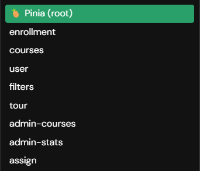
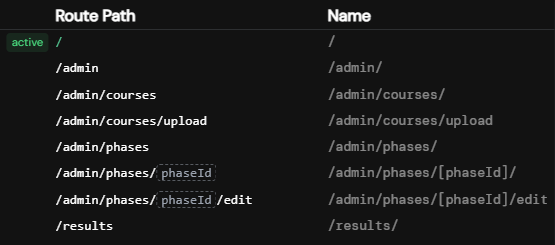

# Frontend documentation

## Overview

The frontend was developed with a mobile-first approach. It was built using the following technologies:

- **Vue.js 3**: A progressive JavaScript framework for building user interfaces.
- **Vuetify**: A Vue UI library with Material Design components.
- **Pinia**: A state management solution for Vue.js, the successor to Vuex.
- **TypeScript**: A statically typed superset of JavaScript that improves the development experience.

## Project Structure

The project is divided into several directories, each serving a specific purpose. Here is an overview of the `src/` directory, the main directory for the frontend application's source code.

### Key Subdirectories and Files:

- **`../assets/`**: Contains static resources such as the logo and i18n language files.
- **`components/`**: Contains reusable Vue components.
- **`composables/`**: Contains reusable Vue composables.
- **`plugins/`**: Initializes the used plugins.
- **`store/`**: Contains the Pinia stores for state management.
- **`views/`**: Contains higher-level view components that often correspond to routes.
- **`App.vue`**: The root component of the application.
- **`main.ts`**: The entry point of the application, where Vue is initialized and the app is mounted.

## Component Structure

### State Management with Pinia

Pinia is used for state management and allows centralized state management throughout the application. Stores are located in the `store/` directory and are modularized by functionality.

- **user**: Handles logging in and out and manages user data.
- **enrollment**: Manages enrollment.
- **courses**: Manages courses.
- **filters**: Manages filters and search.
- **admin-courses**: Manages all courses (visible only to admins).
- **admin-stats**: Manages statistics (visible only to admins).
- **admin-assign**: Manages enrollment phases (visible only to admins).

### Page Components

Page components correspond to specific routes and are located in the `views/` directory. These components use reusable components to create the page. The files in the `views/` directory represent the routes (file-based routing).

### Reusable Components

Reusable components are located in the `components/` directory. Each component typically consists of:

- **Template**: Defines the HTML structure.
- **Script**: Contains the logic of the component, written in TypeScript.
- **Style**: Contains scoped SCSS, specific to the component.

