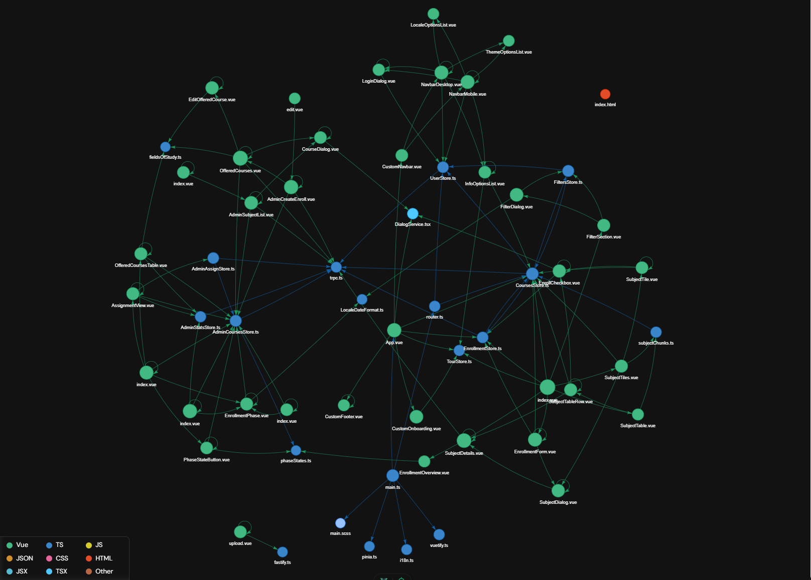

# Frontend Dokumentation

## Überblick

Das Frontend wurde nach dem Mobile-First Ansatz entwickelt. Es wurde mit den
folgenden Technologien erstellt:

- **Vue.js 3**: Ein progressives JavaScript-Framework zur Erstellung von
  Benutzeroberflächen.
- **Vuetify**: Eine Vue UI-Bibliothek mit Material-Design Komponenten.
- **Pinia**: Eine Zustandsverwaltungslösung für Vue.js, der Nachfolger von Vuex.
- **TypeScript**: Eine statisch typisierte Obermenge von JavaScript, die das
  Entwicklungserlebnis verbessert.

## Projektstruktur

Das Projekt ist in mehrere Verzeichnisse unterteilt, von denen jedes eine
bestimmte Aufgabe erfüllt. Hier ist ein Überblick über den `src/` Verzeichnis,
das Hauptverzeichnis für den Quellcode der Frontend-Anwendung.

### Wichtige Unterverzeichnisse und Dateien:

- **`assets/`**: Enthält statische Ressourcen wie das Logo und i18n
  Sprachdateien.

- **`components/`**: Enthält wiederverwendbare Vue-Komponenten.
- **`composables/`**: Enthält wiederverwendbare Vue-Composables.

- **`plugins/`**: Hier werden die verwendeten Plugins initialisiert.

- **`store/`**: Enthält die Pinia-Stores zur Zustandsverwaltung.

- **`views/`**: Enthält höherstufige View-Komponenten, die oft Routen
  entsprechen.

- **`App.vue`**: Die Root-Komponente der Anwendung.
- **`main.ts`**: Der Einstiegspunkt der Anwendung, an dem Vue initialisiert und
  die App gemountet wird.

## Komponentenstruktur

### Zustandsverwaltung mit Pinia

Pinia wird zur Zustandsverwaltung verwendet und ermöglicht eine zentrale
Verwaltung des Zustands in der gesamten Anwendung. Stores werden im `store/`
Verzeichnis abgelegt und nach Funktionalität modularisiert.

- **user**: Übernimmt das Ein- und Ausloggen und verwaltet die User-Daten

- **enrollment**: Verwaltet die Anmeldung

- **courses**: Verwaltet die Kurse

- **filters**: Verwaltet die Filter sowie die Suche

- **admin-courses**: Verwaltet alle Kurse (nur für Admin sichtbar)

- **admin-stats**: Verwaltet die Statistiken (nur für Admin sichtbar)

- **admin-assign**: Verwaltet die Anmeldephasen (nur für Admin sichtbar)

### Seiten-Komponenten

Seiten-Komponenten entsprechen bestimmten Routen und werden im `pages/`
Verzeichnis abgelegt. Diese Komponenten verwenden wiederverwendbare Komponenten
zur Erstellung der Seite. Die Dateien im `pages/` Verzeichnis repräsentieren die
Routen (file based Routing).

### Wiederverwendbare Komponenten

Wiederverwendbare Komponenten werden im `components/` Verzeichnis abgelegt. Jede
Komponente besteht typischerweise aus:

- **Template**: Definiert die HTML-Struktur.
- **Script**: Enthält die Logik der Komponente, geschrieben in TypeScript.
- **Style**: Beinhaltet scoped SCSS, spezifisch für die Komponente.

