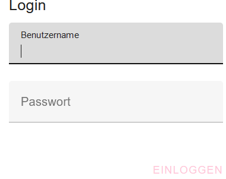
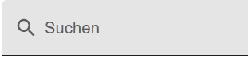
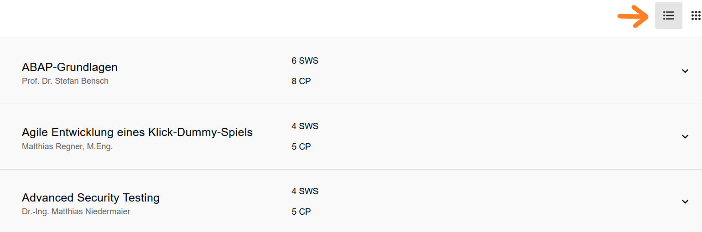
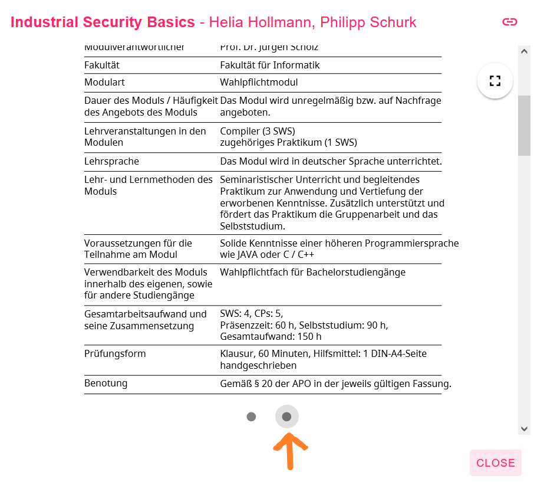
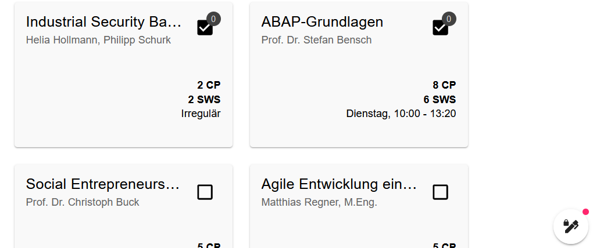
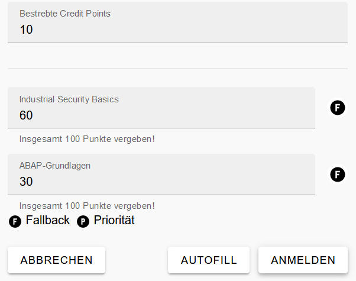

# Dokumentation der Webseite für Studenten

Diese Dokumentation bietet eine umfassende Übersicht über die verschiedenen
Funktionen, die speziell auf die Bedürfnisse von Studenten abgestimmt sind.

## 1 Navigationsleiste

Ganz oben auf der Webseite befindet sich die Navigationsleiste, die aus mehreren
Buttons besteht. Diese Buttons bieten verschiedene Einstellungen und Hilfsmittel
für die Benutzerfreundlichkeit und Funktionalität der Webseite.

### 1.1 Theme wählen

- **Beschreibung und Anwendung:** Mit diesem Button können Sie das
  Erscheinungsbild der Webseite anpassen. Klicken Sie auf den Button "Theme
  wählen" und wählen Sie die gewünschte Option aus dem Dropdown-Menü.
- **Optionen:**
  - **Darkmode:** Wechselt die Webseite in ein dunkles Farbschema.
  - **Lightmode:** Wechselt die Webseite in ein helles Farbschema.
  - **Automode:** Übernimmt die bevorzugte Darstellung des Browsers des
    Studenten (hell oder dunkel).

### 1.2 Sprache wählen

- **Beschreibung und Anwendung:** Dieser Button ermöglicht es Ihnen, die Sprache
  der Webseite zu ändern. Klicken Sie auf den Button "Sprache wählen" und wählen
  Sie die gewünschte Sprache aus dem Dropdown-Menü. Die Webseite wird
  automatisch in die ausgewählte Sprache übersetzt.
- **Optionen:**
  - **Deutsch:** Stellt die Webseite auf die deutsche Sprache um.
  - **Englisch:** Stellt die Webseite auf die englische Sprache um.

### 1.3 Hilfe

- **Beschreibung und Anwendung:** Mit diesem Button können Sie ein Dropdown-Menü
  öffnen, dabei kann man sich entweder für ein Tutorial (kurze Anleitung zur
  Wahl der Wahlpflichtfächer) entscheiden oder man entscheidet sich für die
  Dokumentation (detaillierte Beschreibung der Webseite).

### 1.4 Login

- **Beschreibung und Anwendung:** Dieser Button ermöglicht es Ihnen, sich auf
  der Webseite mit Ihrem Benutzernamen und Passwort anzumelden. Klicken Sie auf
  den Button "Login". Es öffnet sich eine Eingabemaske, in die Sie Ihren
  Benutzernamen und Ihr Passwort eingeben können. Nach erfolgreicher Eingabe
  werden Sie angemeldet und haben Zugriff auf Ihre persönlichen Daten und
  Funktionen.

### 1.5 Logout

- **Beschreibung und Anwendung:** Sobald die Anmeldung abgeschlossen ist wird
  der Benutzername des Studenten in der Navigationsleiste angezeigt und aus dem
  Login-Button wird ein Logout-Button, diesen kann der Student bei Bedarf
  nutzen.

Diese Navigationsleiste ist ein zentraler Bestandteil der Webseite und bietet
schnellen Zugriff auf wichtige Funktionen, die das Nutzererlebnis verbessern.

## 2 Funktionen für die Wahlpflichtfächer

### 2.1 Suchfunktion

Studenten können mithilfe einer Suchleiste, die eine Lupe enthält, nach
Wahlpflichtfächern suchen, wenn sie den Namen des Wahlpflichtfachs kennen.

### 2.2 Filterfunktion

Die Filterfunktion ermöglicht es Studenten, spezifische Kriterien festzulegen,
um die Auswahl der Wahlpflichtfächer einzugrenzen. Folgende Filter können
gesetzt werden: Semesterwochenstunden (0-20), Credit Points (0-20), maximale
Teilnehmeranzahl (0-100), Veranstaltungsart (wöchentlich, Blockveranstaltung,
Irregulär) und der Wochentag. Hiermit bestimmen Studenten, wie viele
Semesterwochenstunden die Wahlpflichtfächer insgesamt haben sollen, und wie
viele Credit Points sie anstreben. Je nachdem, welche **Kriterien** der Student
im Filter angegeben hat, werden ihm dann nur noch die Wahlpflichtfächer
angezeigt, die diese Kriterien erfüllen. Um die Filter zu setzen, wählen die
Studenten entsprechenden Werte in den Filteroptionen aus und bestätigen ihre
Auswahl. Die Liste der Wahlpflichtfächer wird automatisch **aktualisiert** und
zeigt nur noch die **relevanten Ergebnisse** an.

### 2.3 Anpassung der Darstellung

Zusätzlich gibt es zwei Buttons, mit denen der Student die Darstellung der
Wahlpflichtfächer ändern kann. Wenn er auf den Button mit den drei horizontalen
Strichen **(Menu-Button)** klickt, werden ihm die Wahlpflichtfächer zeilenweise
untereinander angezeigt.

Klickt er jedoch auf den Button mit den 3x3 Punkten **(Dots-Grid-Button)**,
werden ihm mehrere Wahlpflichtfächer in einer Zeile angezeigt.

## 3 Wahlpflichtfächer: Informationen, Anmeldung und Änderungen

### 3.1 Detaillierte Informationen zu Wahlpflichtfächern

Wenn der Student auf ein Wahlpflichtfach klickt, öffnet sich ein Pop-up-Fenster,
das folgende Informationen anzeigt:

- **Dozenten**
- **Arbeitsaufwand:** Semesterwochenstunden und Credit Points
- **Maximale Anzahl der Teilnehmer**
- **Termine:** Tag, Datum und Uhrzeit
- **Hinweise:** Informationen wie Exkursionen zu bestimmten Daten oder
  Online-Vorlesungen an bestimmten Tagen

Möchte der Student genauere Informationen zu dem jeweiligen Wahlpflichtfach
erhalten, muss er innerhalb des Pop-up-Fensters ganz unten auf einen Button
klicken, der die Kreisform hat. Dadurch wird ihm innerhalb desselben
Pop-up-Fensters das Modulhandbuch angezeigt, jedoch nur ein Auszug des
Modulhandbuchs, der nur Informationen zu dem jeweiligen Wahlpflichtfach enthält.

### 3.2 Wahlpflichtfach Anmeldung

Die Anmeldung der Wahlpflichtfächer besteht im Grunde aus zwei Phasen: Die Wahl
der Fächer, für die man sich anmelden möchte, und die Priorisierung der
Wahlpflichtfächer.

### Phase 1: Auswahl der Wahlpflichtfächer

- **Auswahl der Fächer:** Der Student kann die Wahlpflichtfächer auswählen,
  indem er auf die Checkbox klickt. Ob ein Fach ausgewählt wurde oder nicht,
  erkennt der Student daran, ob in der Checkbox ein Häkchen gesetzt ist
  (ausgewählt) oder nicht (nicht ausgewählt). Zusätzlich befindet sich eine Zahl
  oberhalb der Checkbox, diese steht für die Priorisierung, was genau das ist
  wird im weiteren Verlauf erläutert.

- **Abwahl der Fächer:** Falls der Student ein Wahlpflichtfach doch nicht mehr
  belegen möchte, kann er erneut auf die Checkbox klicken, um die Auswahl
  aufzuheben.

### Phase 2: Priorisierung der Wahlpflichtfächer

- **Voraussetzung:** Die Priorisierung ist nur möglich, wenn in der ersten Phase
  mindestens ein Wahlpflichtfach ausgewählt wurde. Nur dann wird dem Studenten
  im rechten unteren Eck der Webseite ein Button angezeigt, der als Stift
  dargestellt wird.

- **Öffnen des Priorisierungs-Fensters:** Wenn der Student auf den Button
  klickt, wird ihm ein Pop-up-Fenster angezeigt. Dieses zeigt neben den
  angestrebten Credit Points auch die zuvor ausgewählten Wahlpflichtfächer.
  Unter den Namen der Wahlpflichtfächer steht zu Beginn die Ziffer 0, was
  bedeutet, dass bisher noch keine Priorisierung vorgenommen wurde.
- **Setzen der Prioritäten:** Um die Prioritäten zu setzen, muss jedem Fach eine
  positive Zahl zwischen 0 und 100 zugewiesen werden. Je größer die Zahl, desto
  höher ist die Priorität des jeweiligen Wahlpflichtfachs. Insgesamt müssen alle
  ausgewählten Fächer zusammen die Zahl 100 ergeben, ansonsten ist eine
  Anmeldung nicht möglich. Bei einem Versuch der Anmeldung ohne korrekte
  Priorisierung erscheint eine Fehlermeldung mit dem Hinweis "Insgesamt 100
  Punkte vergeben!".

##### Opitonal: Automatische Punkteverteilung (Autofill)

- Der Student hat die Möglichkeit, mithilfe des "Autofill"-Buttons die
  Verteilung der Punkte automatisch durchführen zu lassen. Je nachdem, welche
  Art von Fach es sich handelt, findet die automatische Verteilung
  unterschiedlich statt. Man kann dabei zwischen Prioritäts-Wahlpflichtfach und
  Fallback-Wahlpflichtfach unterscheiden, diese kann man nach Bedarf ändern,
  indem man auf den Button mit dem "B" oder "P" neben dem jeweiligen
  Wahlpflichtfach klickt.

- **Prioritäts-Wahlpflichtfach:** Diese Fächer haben eine hohe Priorität und
  sollten bevorzugt belegt werden.
- **Fallback-Wahlpflichtfach:** Diese Fächer dienen als Absicherung, falls man
  keines der Prioritäts-Wahlpflichtfächer erhält.

- **Erster Fall - Nur Prioritäts-Wahlpflichtfächer:** Angenommen, man hat zwei
  Wahlpflichtfächer ausgewählt, und beide sind als Prioritäts-Wahlpflichtfächer
  markiert. Wenn der Student nun auf den "Autofill"-Button klickt, werden die
  100 Punkte gleichmäßig auf die Anzahl der ausgewählten Wahlpflichtfächer
  verteilt. In diesem Fall erhalten beide Wahlpflichtfächer jeweils 50 Punkte.

- **Zweiter Fall - Prioritäts- und Fallback-Wahlpflichtfächer gemischt:** Falls
  zusätzlich Fallback-Wahlpflichtfächer genutzt werden und anschließend der
  "Autofill"-Button genutzt wird, erfolgt die Verteilung wie folgt: Angenommen,
  man hat erneut zwei Fächer ausgewählt, wobei eines dieser Fächer ein
  Fallback-Wahlpflichtfach und das andere ein Prioritäts-Wahlpflichtfach ist. In
  diesem Szenario erhält das Fallback-Wahlpflichtfach 1 Punkt, und das
  Prioritäts-Wahlpflichtfach erhält 99 Punkte. Fallback-Fächer bekommen immer
  einen Punkt, sobald man "Autofill" verwendet, denn diese Fächer sollen nur
  dazu dienen, dass man als Student zumindest das Fallback-Wahlpflichtfach
  bekommt, falls man keines der Prioritäts-Wahlpflichtfächer erhält. Das
  Fallback-Fach ist also nur für den Worst-Case gedacht. Es macht daher Sinn,
  dem Fallback-Fach die geringste Punktzahl zu geben, nämlich 1 Punkt.

- **Abschließen der Anmeldung:** Wenn der Student die Prioritäten so verteilt
  hat, dass sie insgesamt 100 Punkte ergeben, kann die Anmeldung über den Button
  "Anmeldung" innerhalb des Pop-up-Fensters abgeschlossen werden.

### 3.3 Änderungen und Abwahlen

- **Änderungen:** Wenn der Student nachträglich Änderungen vornehmen möchte, wie
  z.B. ein Wahlpflichtfach abwählen, muss er auf die Checkbox des jeweiligen
  Fachs klicken. Es öffnet sich ein Pop-up-Fenster, das ihn darüber informiert,
  dass durch diese Aktion die vergebenen Punkte verloren gehen.

- **Bestätigen der Abwahl:** Wenn der Student seine Aktion bestätigt, werden die
  Punkte des abgewählten Wahlpflichtfachs gleichmäßig auf die restlichen
  ausgewählten Wahlpflichtfächer aufgeteilt.

## 4 Ergebnis der Wahlpflichtfach-Auslosung einsehen

Falls ein Student nachsehen möchte, welche Wahlpflichtfächer er nach der
Auslosung erhalten hat, muss er auf den Balken unterhalb der Navigationsleiste
klicken.

Sobald der Balken angeklickt wurde, gelangt der Student zu einer Ansicht, die
anzeigt, welche Wahlpflichtfächer ihm zugewiesen wurden. Falls neben einem
Wahlpflichtfach ein Fragezeichen steht, bedeutet dies, dass die Auslosung noch
nicht stattgefunden hat.

